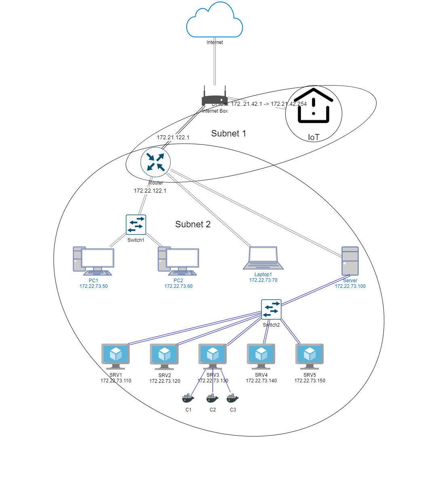

## Portfolio IT / Administration Systèmes et Réseaux

### Inventaire du matériel (hors IoT, smartphones et câbles RJ45)
|Nom	|Type de matériel	|
|---	|---	|
|Internet Box	|Routeur	|
|Router	|Routeur	|
|PC1	|PC	|
|PC2	|PC	|
|Server	|PC	|
|Laptop1	|Ordinateur Portable	|
|Switch1	|Commutateur	|

### Schéma du réseau

